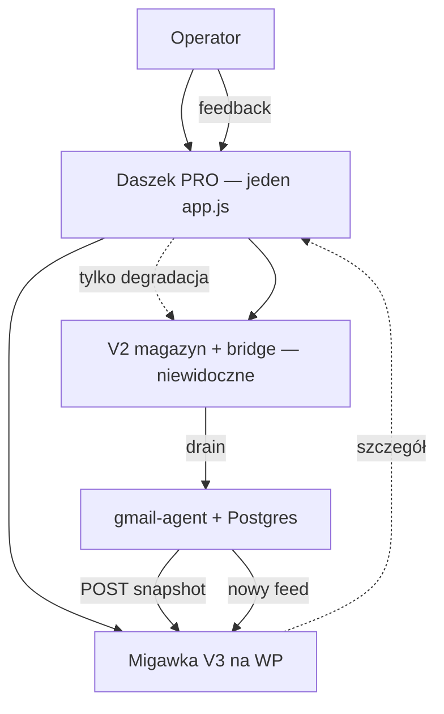
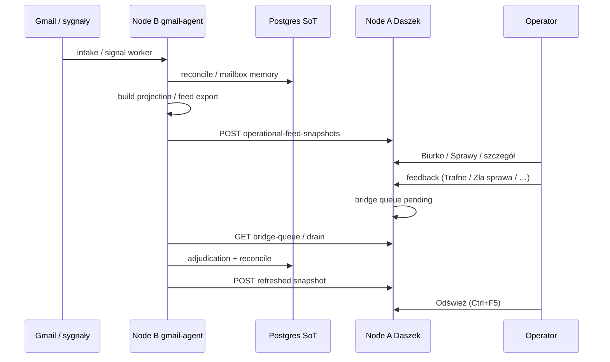

# Daszek — kompletna dokumentacja (TOP-INSTAL)

**Status:** jedyny kanoniczny dokument Daszek (2026-06-01)
**Kanoniczny kod wtyczki:** [`daszek/`](daszek/) (nie `gmail-agent/Daszek/` — usunięte)

Wszystkie wcześniejsze pliki `DASZEK_*.md`, `daszek/*.md` (w tym `AGENTS.md`, `CHANGELOG.md`, `fixtures/v3/README.md`) zostały **scalone tutaj i usunięte**. Przy zmianach edytuj **wyłącznie** ten plik (+ kod). Proof z datami: [`gmail-agent/docs/runbooks/LAST_PROVEN_STATE.md`](gmail-agent/docs/runbooks/LAST_PROVEN_STATE.md).

---

## Spis treści

1. [Werdykt produktowy](#1-werdykt-produktowy)
2. [Jedność PRO — jeden panel operatorski](#2-jedność-pro--jeden-panel-operatorski)
3. [Topologia: Node A i Node B](#3-topologia-node-a-i-node-b)
4. [gmail-agent (Node B) — rola i przepływ](#4-gmail-agent-node-b--rola-i-przepływ)
5. [Daszek (Node A) — rola i przepływ](#5-daszek-node-a--rola-i-przepływ)
6. [Razem: pełna pętla operatorska](#6-razem-pełna-pętla-operatorska)
7. [UI PRO: nawigacja, warstwy L0–L4, copy](#7-ui-pro-nawigacja-warstwy-l0l4-copy)
8. [Operational feed V3 — kontrakt i eksport](#8-operational-feed-v3--kontrakt-i-eksport)
9. [Warstwa V2 — magazyn i degradacja (nie drugi produkt)](#9-warstwa-v2--magazyn-i-degradacja-nie-drugi-produkt)
10. [Feedback operatora (B1 / B2) i bridge queue](#10-feedback-operatora-b1--b2-i-bridge-queue)
11. [Skrzat, ingress quality, kohorty](#11-skrzat-ingress-quality-kohorty)
12. [Wdrożenie i operacje](#12-wdrożenie-i-operacje)
13. [Weryfikacja, smoke i proof](#13-weryfikacja-smoke-i-proof)
14. [Mapa plików w repozytorium](#14-mapa-plików-w-repozytorium)
15. [Antywzorce i granice](#15-antywzorce-i-granice)
16. [Przewodnik agenta (contract-gate)](#16-przewodnik-agenta-contract-gate)
17. [Luki docelowe (As-Is → To-Be)](#17-luki-docelowe-as-is--to-be)
18. [Historia wersji pluginu](#18-historia-wersji-pluginu)
19. [Scalenie dokumentacji (2026-06-01)](#19-scalenie-dokumentacji-2026-06-01)

---

## 1. Werdykt produktowy

**TOP-INSTAL AI-OS nie jest autonomicznym agentem mailowym.** To system **pamięci, kontekstu i projekcji operatorskiej**:

- Źródła (Gmail, Drive, kalendarz) → mailbox memory / journal na **Node B**
- Kontrolowane tacki kontekstu → LLM jako **kompozytor projekcji** (nie źródło prawdy)
- **Daszek** + **Skrzat** → operator czyta, ocenia, koryguje
- Feedback → reconcile → **odświeżona migawka** do UI

| Twierdzenie          | Prawda                                                   |
| -------------------- | -------------------------------------------------------- |
| SoT sprawy           | **Postgres** po `reconcile` (`gmail-agent`, Node B)      |
| Daszek               | **Projekcja** + overlay (archiwum WP) + bounded feedback |
| LLM                  | Nie wykonuje produkcyjnie bez HITL / policy              |
| Daszek ≠ gmail-agent | Partnerzy HTTP; nie wymienne kopie                       |

Powiązane normy: [`gmail-agent/docs/core/CONTEXT_PROJECTION_KNOWLEDGE_GRAPH.md`](gmail-agent/docs/core/CONTEXT_PROJECTION_KNOWLEDGE_GRAPH.md), [`gmail-agent/docs/core/truth_flow.md`](gmail-agent/docs/core/truth_flow.md).

---

## 2. Jedność PRO — jeden panel operatorski

Operator widzi **jeden produkt**: panel Daszek PRO (plugin **1.3.1**), nie „V3 obok V2”.

| Warstwa widoczna                   | Źródło danych                                                                        |
| ---------------------------------- | ------------------------------------------------------------------------------------ |
| **Biurko, Sprawy, Dzień, Zadania** | Migawka `daszek_operational_feed_snapshot` (`feed.*`, `feed.case_details`)           |
| **Archiwum**                       | Overlay Node A (`operator_case_archive.json`) — ukrywa listy, nie kasuje Postgres    |
| **Szczegół sprawy**                | Najpierw `case_details` z feedu; przy braku — degradacja GET `/daszek/v2/cases/{id}` |
| **V2 pod spodem**                  | `desk_notes.json`, `bridge-queue`, ID kartek — **infrastruktura**, nie drugi panel   |

Docelowy stan operacyjny: **zawsze świeży operational feed** z Node B. Etykieta „Warstwa v2 (legacy)” na liście Spraw to **stan błędu zasilenia**, nie docelowy tryb pracy.



---

## 3. Topologia: Node A i Node B

### Lokalny dev (kanoniczny — Docker)

| Węzeł      | Compose                                                                                | URL z hosta             | Rola                             |
| ---------- | -------------------------------------------------------------------------------------- | ----------------------- | -------------------------------- |
| **Node A** | [`docker-compose.daszek-local.yml`](docker-compose.daszek-local.yml)                   | `http://127.0.0.1:8090` | WP + plugin [`daszek/`](daszek/) |
| **Node B** | [`gmail-agent/docker-compose.local-vps.yml`](gmail-agent/docker-compose.local-vps.yml) | `http://127.0.0.1:8766` | API, worker, Postgres `:54329` (`GMAIL_AGENT_NODEB_PORT`) |

**Start (skrót):**

```powershell
# z root monorepo
docker compose -f docker-compose.daszek-local.yml up -d
cd gmail-agent
docker compose --env-file .env.vps -f docker-compose.local-vps.yml up -d mailbox-memory-db neo4j ollama
docker compose --env-file .env.vps -f docker-compose.local-vps.yml --profile api up -d gmail-agent-nodeb-api
docker compose --env-file .env.vps -f docker-compose.local-vps.yml --profile worker up -d gmail-agent-worker
```

**Env lokalne (gitignored):** `.env.daszek-local` (tokeny WP), `gmail-agent/.env.local-vps` (aplikacja w kontenerze), `gmail-agent/tools/gmail_audit/.env` (CLI/pytest).

WP w Dockerze widzi Node B jako `http://host.docker.internal:8766` (`WORDPRESS_CONFIG_EXTRA` w compose; port z `GMAIL_AGENT_NODEB_PORT`). Node B pushuje feed na `http://host.docker.internal:8090`.

Po zmianach w kodzie Node B: `docker compose ... build gmail-agent-nodeb-api gmail-agent-worker` + recreate kontenerów (obraz **nie** mountuje źródeł — tylko `.env`).

### Produkcja (historyczna — Hostido + VPS)

| Węzeł      | Host (prod)           | Katalog / scope                                             | Rola                                             |
| ---------- | --------------------- | ----------------------------------------------------------- | ------------------------------------------------ |
| **Node A** | `topinstal.com.pl`    | `wp-content/plugins/daszek/` ← [`daszek/`](daszek/)         | UI, odbiór migawek, bridge storage, proxy Skrzat |
| **Node B** | VPS `178.104.171.104` | `/opt/gmail-agent/current` ← [`gmail-agent/`](gmail-agent/) | Intake, reconcile, Postgres, eksport feed, drain |

**Brak współdzielonego dysku.** Komunikacja: HTTP/REST (`DASZEK_NODE_B_API_BASE`, `X-Daszek-Bridge-Token`, POST feed, GET bridge-queue).

### wp-config.php (Node A — prod) / `.env.daszek-local` (lokalnie)

```php
define('DASZEK_NODE_B_API_BASE', 'http://178.104.171.104:8443');
define('DASZEK_NODE_B_API_TOKEN', '<NODE_B_REGISTRY_TOKEN z VPS>');
define('DASZEK_BRIDGE_TOKEN', '<DASZEK_BRIDGE_TOKEN z VPS>');
define('DASZEK_NODE_B_SERVICE_TOKEN', '<DASZEK_NODE_B_SERVICE_TOKEN z VPS>');
```

Gotowy blok do wklejenia na **prod** (sekrety): [`knowledge/.local-secrets/wp-config-daszek-1.3.3.transfer.php`](knowledge/.local-secrets/wp-config-daszek-1.3.3.transfer.php) — **nie commituj**. Lokalnie używaj `.env.daszek-local` + compose.

Token na B (prod VPS): `/etc/topinstal/gmail-agent.env`. Lokalnie: `gmail-agent/.env.local-vps` montowane jako `/etc/topinstal/gmail-agent.env`.

Po wgraniu pluginu: **flush permalinków** (WP → Ustawienia → Bezpośrednie odnośniki → Zapisz).

---

## 4. gmail-agent (Node B) — rola i przepływ

**Samodzielnie** gmail-agent to runtime intelligence i backoffice (CLI, API `:8765` / `:8443`, worker, doctor). Operator **może** pracować bez Daszka, ale **docelowy UX** to panel WP.

### Oś techniczna (skrót)

1. `process_snapshot` / `signal-worker` → RawObservation → CanonicalSignal → journal
2. `reconcile_signal` → mailbox memory (SoT)
3. `build_case_context_pack` + (pod flagami) intelligence / policy / proposals
4. `daszek_v3_operational_feed.py` → migawka JSON
5. POST na Node A; opcjonalnie `daszek_bridge_queue_drain` ← feedback

### Moduły Daszek po stronie B

| Moduł                       | Plik                                                                      |
| --------------------------- | ------------------------------------------------------------------------- |
| Eksport feed V3             | `gmail-agent/tools/gmail_audit/daszek_v3_operational_feed.py`             |
| Kontrakt + `FORBIDDEN_KEYS` | `gmail-agent/tools/gmail_audit/daszek_v3_operational_feed_contract.py`    |
| Transport projekcji (PR-8)  | `gmail-agent/tools/gmail_audit/projection_snapshot_transport.py`          |
| Push v2 (legacy / Gate B)   | `gmail-agent/tools/gmail_audit/dash_projection_v2.py`, `daszek_client.py` |
| Polityka push               | `gmail-agent/tools/gmail_audit/daszek_push_policy.py`                     |
| Drain mostu                 | `gmail-agent/tools/gmail_audit/daszek_bridge_queue_drain.py`              |
| Skrzat                      | `gmail-agent/tools/gmail_audit/skrzat_runtime.py`, `skrzat_copilot.py`    |

**Move 5 (częściowo domknięte 1.3.3):** przy `DASZEK_FEED_SOURCE=engagement_snapshot_v2` v2 live push jest blokowany (`daszek_legacy_v2_push_allowed`, `v2_runtime`); UI Spraw nie degraduje do listy v2 — tylko komunikat braku feedu V3.

---

## 5. Daszek (Node A) — rola i przepływ

**Samodzielnie** (bez Node B) Daszek to pusta lub przestarzała wtyczka WP — **brak sensu produkcyjnego**.

### Odpowiedzialności

- Render `public/app.js` + `public/style.css`
- Walidacja POST migawki (`includes/api-v2.php`)
- Magazyn migawek V3 (`includes/store-v3.php`)
- Magazyn v2: desk, cases, bridge (`includes/store-v2*.php`)
- Proxy Skrzat / engagement do Node B

### Weryfikacja lokalna (bez prod)

```bash
# z daszek/
node --check public/app.js
php -l includes/api-v2.php

# z gmail-agent/
python -m pytest tools/gmail_audit/tests/test_daszek_v3_surface_static.py tools/gmail_audit/tests/test_daszek_v3_fixtures.py tools/gmail_audit/tests/test_agent_hitl_bridge.py -q
```

Lokalne testy **≠** proof WordPress produkcyjny.

---

## 6. Razem: pełna pętla operatorska



### Granice (niezmienne)

- Daszek **nie** wysyła Gmaila, ofert ani akcji bez pipeline + HITL na B.
- Feed: `read_only: true`, `creates_cases: false`, `executes_actions: false`.
- Archiwum WP **nie** kasuje rekordu w Postgres (kolejny feed może sprawę przywrócić na liście aktywnej).

---

## 7. UI PRO: nawigacja, warstwy L0–L4, copy

### Nawigacja (1.3.0)

Górny pasek: **Biurko | Sprawy | Dzień | Archiwum | Zadania**
Rzadkie widoki: **Więcej ▾** (Cockpit, Jakość AI, kohorty, …).

### Warstwy szczegółowości (L0–L4)

| Warstwa | Zawartość                                                                          |
| ------- | ---------------------------------------------------------------------------------- |
| **L0**  | Tytuł widoku + jedna linia „Ostatnia aktualizacja” (bez `snapshot_id` na wierzchu) |
| **L1**  | 2–4 karty metryk (liczba + label PL); klik może filtrować listę                    |
| **L2**  | Lista: kotwica, 2–3 pola, jeden primary CTA                                        |
| **L3**  | Panel szczegółu: sekcje ze skrótem; pełnia w accordion                             |
| **L4**  | Meta techniczna: zagnieżdżone „+ Szczegóły systemu → + Pełne dane techniczne”      |

### Widoki i intencje

| Widok           | Intencja                          | Dane                              |
| --------------- | --------------------------------- | --------------------------------- |
| Biurko          | Co dziś wymaga uwagi              | `feed.desk`                       |
| Dzień           | Plan dnia / fallback              | `feed.day`                        |
| Sprawy          | Przegląd + szczegół               | `feed.cases`, `feed.case_details` |
| Zadania         | Next actions                      | `feed.tasks`                      |
| Archiwum        | Sprawy ukryte (overlay A)         | REST v2 case-archive              |
| Ostatni ingress | Bounded ingress (osobny kontekst) | `ingress-quality-snapshots`       |
| Kohorty         | Uruchomienia testów               | `/daszek/v3/cohort-runs`          |

**Nie mieszać** na jednym ekranie listowym: operational feed vs ingress quality.

### Copy (PL) — zasady

1. Język operatora, nie nazw pól JSON.
2. Rozróżniaj: **brak danych** / **brak problemu** / **sekcja niedostępna**.
3. Rekomendacje ≠ wykonane akcje (badge, sekcje serwis vs marketing).
4. Dowody i JSON techniczny w `<details>`, nie w nagłówku karty.

Zalecane etykiety: Dowody, Braki danych, Sprzeczności, Propozycje działań, Historia decyzji operatora.

**Antywzorce copy:** surowe `policy_status` w nagłówku; sugestia autonomicznego wykonania; angielskie resztki w sekcjach głównych.

### Feedback — przyciski

| Przycisk               | Kiedy                             |
| ---------------------- | --------------------------------- |
| **Trafne**             | Dobre podsumowanie AI             |
| **Zła sprawa**         | Zły `case_id` — wymaga notatki v2 |
| **To już nieaktualne** | Temat zamknięty                   |
| **Tylko w sprawie**    | Uwaga do sprawy, nie kartki       |

Bez `case_id` — najpierw powiąż ze sprawą. Gate B green **≠** przyciski na feedzie (patrz [§10](#10-feedback-operatora-b1--b2-i-bridge-queue)).

### Onboarding operatora (1 strona)

**Biurko** — kartki „na dziś”: tytuł, sedno (PL), data aktywności. Technika pod **„+ Szczegóły systemu”**, nie na wierzchu.

**Czego nie czytać na co dzień:** linie _Migawka: gateb-…_, `schema`, surowe ID — są w rozwinięciu technicznym.

**Zła sprawa** wymaga prawdziwej sprawy i notatki v2; przy samej kartce `desk-…` — najpierw otwórz szczegóły, potem przyciski.

### Zasady UI (task-oriented) — failure modes

- Nie mieszaj **operational feed** z **ingress quality** na jednym ekranie listowym.
- Przy zmianie kontraktu feed: Python contract → PHP walidator → pytest → dopiero `app.js` / fixture.
- Dwa sprzeczne „źródła prawdy” między planem a tym README bez jawnej decyzji = błąd procesu.
- Screenshot UI **nie** jest dowodem zapisu w Postgres.

### Macierz fixture V3 (`daszek/fixtures/v3/`)

| Plik                                            | Zawartość                                                |
| ----------------------------------------------- | -------------------------------------------------------- |
| `normal.json`                                   | Sprawa z dowodami + propozycja                           |
| `conflicts.json`                                | Sprzeczności                                             |
| `gaps.json`                                     | Braki danych                                             |
| `service_signal.json` / `marketing_signal.json` | Sygnały; granica „rekomendacja, nie wykonane”            |
| `sparse.json`                                   | Uboga projekcja                                          |
| `proposal_sparse.json`                          | Propozycja bez payload/evidence                          |
| `proposed_only.json`                            | Tylko `proposed_next_actions` (brak `action_proposals`)  |
| `operational_feed_snapshot.json`                | Bogaty feed + `case_details`                             |
| `operational_feed_empty.json`                   | Puste listy — empty states                               |
| `operational_feed_sparse.json`                  | Jedna sprawa; test fallback v2                           |
| `operational_feed_agent_runtime.json`           | PR-E: HITL pending, `agent_turns`, EngagementSnapshot.v2 |
| `ingress_quality_snapshot.json`                 | Jakość bounded ingress (osobny kontekst)                 |

Po edycji `app.js` przejdź fixture w kolejności powyżej (15–30 s każdy). Operator powinien móc odpowiedzieć: _Co dalej? Na czym opiera się sugestia? Czy wykonano? Czy wymaga akceptacji?_

**CSS / `<details>`:** dowody i JSON w rozwinięciu; karty propozycji — Akceptuj/Odrzuć tylko przy `status: proposed` i `proposal_id`.

### HITL agent runtime (PR-E, od 1.3.2)

Przyciski **ZATWIERDŹ** / **WYŚLIJ** w szczegółach sprawy (gdy `hitl_pending` / `hitl_required`):

| Akcja UI  | REST Daszek                          | Efekt                                                                                     |
| --------- | ------------------------------------ | ----------------------------------------------------------------------------------------- |
| ZATWIERDŹ | `POST /daszek/v2/agent-hitl/approve` | Proxy → Node B `POST /engagements/{id}/hitl/approve` (CAS snapshot, zdejmuje `hitl_gate`) |
| WYŚLIJ    | `POST /daszek/v2/agent-hitl/send`    | Wpis w `bridge_queue.jsonl` (`domain: agent_hitl`) → drain Node B                         |

Wymagane env na WP: `DASZEK_NODE_B_API_BASE`, `DASZEK_NODE_B_API_TOKEN` (Bearer do FastAPI Node B). Tylko owner (`konrad`, `darek`) może zatwierdzać HITL.

Fixture smoke: `operational_feed_agent_runtime.json` — sprawa z `hitl_required: true` i sekcją `agent_turns`.

**Proof lokalny (Docker):** `python tools/gmail_audit/scripts/daszek_local_133_proof.py` → `DASZEK_LOCAL_133_PROOF_OK` (patrz §13).

---

## 8. Operational feed V3 — kontrakt i eksport

### Envelope (wymagania)

| Pole               | Wartość                                                                                                |
| ------------------ | ------------------------------------------------------------------------------------------------------ |
| `schema_name`      | `daszek_operational_feed_snapshot`                                                                     |
| `schema_version`   | `1` (akceptowane też `1.0` z ostrzeżeniem)                                                             |
| `snapshot_id`      | wymagany                                                                                               |
| `read_only`        | `true`                                                                                                 |
| `creates_cases`    | `false`                                                                                                |
| `executes_actions` | `false`                                                                                                |
| `feed`             | obiekt: `desk`, `cases`, `tasks` (listy), `case_details` (mapa), opcjonalnie `day`, `quality_readonly` |

### Prywatność — zabronione klucze (wszędzie w drzewie)

`email_body`, `body`, `snippet`, `subject`, `raw_llm`, `raw_response`, `raw_body`, `message_body`, `prompt`, `prompt_text`, `attachment_bytes`

Mirror: Python `FORBIDDEN_KEYS_ANYWHERE` ↔ PHP `daszek_v3_validate_operational_feed_snapshot_payload`.

### Contract-gate (kolejność zmian)

1. `gmail-agent/tools/gmail_audit/daszek_v3_operational_feed_contract.py`
2. `daszek/includes/api-v2.php`
3. `gmail-agent/tools/gmail_audit/tests/test_daszek_v3_*.py`
4. `daszek/public/app.js` + `daszek/fixtures/v3/`

Przy sprzeczności: **kontrakt JSON (Py + PHP) > copy operatora > AGENTS.md**.

### Eksport (Node B)

```bash
python tools/gmail_audit/daszek_v3_operational_feed.py \
  --from-mailbox-memory \
  --case-limit 50 \
  --task-limit 80 \
  --environment production \
  --out runs/current/daszek_v3_operational_feed_snapshot.json
```

Opcje: `--desk-notes-json` (B1), `--dry-run`, `--allow-empty`, `--cockpit-json` (bez DB).

Pola feedu (1.3.0): m.in. `operator_essence_pl`, `v2_desk_note_id`, `feedback_eligible`; filtr artefaktów Gate B (`gateb-*`, `*badbad*`).

### POST / GET (Node A)

```bash
# POST (token mostu — nie logować w czacie)
curl -sS -X POST "https://topinstal.com.pl/wp-json/daszek/v3/operational-feed-snapshots" \
  -H "Content-Type: application/json" \
  -H "X-Daszek-Bridge-Token: <DASZEK_BRIDGE_TOKEN>" \
  --data-binary @daszek_v3_operational_feed_snapshot.json

# GET latest (sesja operatora lub ten sam token mostu — od 2026-05-27)
curl -sS -H "X-Daszek-Bridge-Token: $DASZEK_BRIDGE_TOKEN" \
  "https://topinstal.com.pl/wp-json/daszek/v3/operational-feed-snapshots/latest"
```

Akceptowany też `Authorization: Bearer <token>` — preferuj `X-Daszek-Bridge-Token` w skryptach.

### Fixtures (syntetyczne)

Katalog: [`daszek/fixtures/v3/`](daszek/fixtures/v3/). Eksport z B powinien pasować do `operational_feed_snapshot.json`.

---

## 9. Warstwa V2 — magazyn i degradacja (nie drugi produkt)

| Element                            | Rola w jedności PRO                                                    |
| ---------------------------------- | ---------------------------------------------------------------------- |
| `store-v2*.php`, `desk_notes.json` | ID kartek, bridge, archiwum overlay                                    |
| REST `/daszek/v2/bridge-queue`     | Kolejka feedbacku → drain na B                                         |
| GET `/daszek/v2/cases/{id}`        | **Degradacja** szczegółu gdy brak w `case_details`                     |
| Lista Spraw bez feedu              | Komunikat + opcjonalna lista v2 z hintem „legacy” = **błąd zasilenia** |
| v1 `/daszek/v1/tasks`              | Historyczny tor intake preview; nie centrum PRO                        |

### Rozjazd feed ↔ kartka v2

Jeśli feed otwiera `note_id` brakujący w `desk_notes.json` na WP:

1. Świeży push operational feed z B.
2. Opcjonalnie v2 ingest z B (`--push-daszek` w intake) — runbook Gate B.

Preflight przed POST: `--desk-notes-json` + `--dry-run` → `desk_note_preflight` w stdout.

---

## 10. Feedback operatora (B1 / B2) i bridge queue

### Dlaczego Gate B green ≠ przyciski na feedzie

| Dowód        | Potwierdza                       | Nie daje                                    |
| ------------ | -------------------------------- | ------------------------------------------- |
| Gate B green | v2 push, drain `zla_sprawa` w WP | Pola w JSON feed                            |
| Feed push    | `operator_essence_pl`, biurko    | `feedback_eligible` bez mapowania `note_id` |
| UI           | `note_*` + `case_id` + flagi     | Przyciski na `desk-*` bez mapowania         |

### B1 — szybka (ręczne `desk_notes.json` z Hostido)

1. Pobierz `wp-content/uploads/daszek/v2/desk_notes.json`
2. Na VPS: `/tmp/desk_notes.json`
3. Eksport z `--desk-notes-json` → `apply_v2_desk_note_ids_from_desk_notes_store()`
4. Push prod
5. W JSON: `v2_desk_note_id`, `feedback_eligible: true`

Windows:

```powershell
powershell -File gmail-agent/tools/scripts/push_daszek_prod_feed.ps1 -DeskNotesJson path/to/desk_notes.json
```

Pełny build na VPS (przykład):

```bash
cd /opt/gmail-agent/current
docker compose --env-file .env.vps -f docker-compose.vps.yml build gmail-agent-worker

RUN_ID="daszek-feed-b1-$(date -u +%Y%m%dT%H%M%SZ)"
OUT="/opt/gmail-agent/current/runs/${RUN_ID}"
mkdir -p "$OUT"

docker compose --env-file .env.vps -f docker-compose.vps.yml --profile worker run --rm -T \
  -e PYTHONPATH=/app/tools/gmail_audit \
  -v "${OUT}:/out" \
  -v /tmp/desk_notes.json:/tmp/desk_notes.json:ro \
  gmail-agent-worker \
  python /app/tools/gmail_audit/daszek_v3_operational_feed.py \
    --from-mailbox-memory --case-limit 50 --task-limit 80 \
    --desk-notes-json /tmp/desk_notes.json \
    --environment production --out /out/operational_feed_snapshot.json

bash deploy/push_daszek_operational_feed_prod.sh
```

Weryfikacja JSON: `feed.cases[].v2_desk_note_id`, `feedback_eligible: true`.

### B2 — trwała (wdrożone 2026-05-25)

- `mailbox_v2_desk_note.resolve_v2_desk_note_id()` w eksporterze
- Po v2 push: `persist_open_desk_note_id_from_v2_projection()` → metadata Postgres
- Backfill: `python tools/gmail_audit/backfill_open_desk_note_id.py`

**Done:** push **bez** `--desk-notes-json` ma `feedback_eligible: true` na sprawach z intake.

### Fallback UI

Kartka `desk-*` bez `feedback_eligible`: przyciski po wejściu w szczegóły → GET v2 live → `renderNoteFeedbackBlock`.

### Bridge drain (Node B)

1. `GET /wp-json/daszek/v2/bridge-queue` + `X-Daszek-Bridge-Token`
2. Przetwarzanie (`daszek_bridge_queue_drain.py` / intake hook)
3. `POST .../bridge-queue/complete` z `queue_id`, status `completed` lub `failed` + krótki `bridge_error`
4. `persist_and_execute_adjudication_truth_loop` → reconcile

**Maintenance (kolejność):**

1. Odczyt `pending`
2. Dry-run drain
3. Real drain bounded (`--max-items N`)
4. Weryfikacja statusu po drain

Zasady: każda mutacja ma artefakt; brak sekretów w logach; **`pending=0` nie jest samodzielnym proofem** pętli operatora.

Komenda: `gmail_intake.py daszek-bridge-drain` — patrz też `gmail-agent/docs/runbooks/GATE_B_OPERATOR_CHECKLIST_A2.md`.

**Ingress quality:** ten sam wzorzec auth co feed; `DaszekClient.post_v3_ingress_quality_snapshot`; transient 429/502/503/504 z backoff po stronie klienta.

---

## 11. Skrzat, ingress quality, kohorty

| Powierzchnia    | Node B                                          | Node A                                          |
| --------------- | ----------------------------------------------- | ----------------------------------------------- |
| Skrzat Q&A      | `skrzat_runtime.py`                             | Proxy `daszek_api_v3_skrzat_ask` w `api-v2.php` |
| Engagement      | API `/cases/{id}/engagement`                    | Proxy v3 routes                                 |
| Ingress quality | `DaszekClient.post_v3_ingress_quality_snapshot` | Osobny widok — nie mieszać z feed listą         |
| Kohorty         | Metryki na B                                    | `GET /daszek/v3/cohort-runs` w UI               |

### Node A → Node B (staging / proxy)

WordPress na Hostido (`185.110.51.208`) woła Node B przez Caddy **:8443** (nie publiczne :8765).

```php
define('DASZEK_NODE_B_API_BASE', 'http://178.104.171.104:8443');
define('DASZEK_NODE_B_API_TOKEN', '<NODE_B_REGISTRY_TOKEN>');
```

Smoke z dowolnego hosta z tokenem:

```bash
curl -sS -H "Authorization: Bearer $TOKEN" \
  "http://178.104.171.104:8443/cases/case_c02cfc10b5b9/engagement"
```

**Wymagane trasy pluginu** (sam `wp-config.php` nie wystarczy):

- `GET /wp-json/daszek/v3/cases/{id}/engagement`
- `GET /wp-json/daszek/v3/engagements/{id}/snapshot`
- Proxy Skrzat w `includes/api-v2.php`

Jeśli engagement zwraca **404** — wgraj `api-v2.php`, `config.php`, `app.js`. **401** = trasa OK, brak sesji.

**Nav nie przełącza się (historyczny bug):** brak `#refresh-btn` w `index.php` + stary `app.js` rzucał w `DOMContentLoaded` → handlery nav nie podpięte. Fix w **1.2.2+**: `index.php`, `bindClick`, `installDaszekNavHandlers`.

Szybki check po upload:

```powershell
(Invoke-WebRequest -Uri "https://topinstal.com.pl/daszek/" -UseBasicParsing).Content -match 'refresh-btn'
```

**Łańcuch weryfikacji:**

1. VPS: `bash deploy/p0_caddy_daszek_smoke.sh` → `caddy_case_engagement_http=200`
2. Anon curl engagement → **401** (nie 404)
3. Zalogowany Daszek: sprawa z blokiem **Zlecenie Cieplo** bez `node_b_unconfigured`
4. REST z sesją: `ok: true`, `labels_pl` z **Zlecenie Cieplo** (nie `lead`)

Context Projection (trays, envelope) — centrum produktu na B; bounded proof: [`gmail-agent/docs/runbooks/CONTEXT_PROJECTION_BOUNDED_PROOF.md`](gmail-agent/docs/runbooks/CONTEXT_PROJECTION_BOUNDED_PROOF.md).

---

## 12. Wdrożenie i operacje

### Dwa potoki (zawsze rozdzielone)

| Potok      | Komenda                                                                                                    | Aktualizuje                      |
| ---------- | ---------------------------------------------------------------------------------------------------------- | -------------------------------- |
| **Node B** | `.\gmail-agent\deploy\sync-p0-to-vps.ps1` → `ssh … bash /opt/gmail-agent/current/deploy/p0-vps-rollout.sh` | Postgres, worker, eksporter feed |
| **Node A** | `cd daszek && ./deploy.sh production`                                                                      | `app.js`, CSS, PHP, `daszek.php` |

`sync-p0-to-vps` **nie** dotyka WordPressa. Po zmianie UI: **Ctrl+F5** (cache `app.js?v=`).

### Paczka WordPress (wymagane pliki runtime)

```
daszek.php, uninstall.php
includes/api.php, api-v2.php, auth.php, config.php, cron.php, cycles.php
includes/store.php, store-v2.php, store-v2-domain.php, store-v2-read.php
includes/store-v2-compat.php, store-v2-operator.php, store-v3.php
public/app.js, index.php, style.css, favicon.svg
```

**Nie pakować:** `config.local.php`, `tools/`, `deploy.sh`, `.gitignore`.

### Rutyna push feed (po zmianie eksportera)

1. `sync-p0-to-vps.ps1`
2. Rebuild workera na VPS:

```bash
ssh root@178.104.171.104 "cd /opt/gmail-agent/current && docker compose --env-file .env.vps -f docker-compose.vps.yml build gmail-agent-worker"
```

3. Push:

```powershell
powershell -File gmail-agent/tools/scripts/push_daszek_prod_feed.ps1
```

Na VPS:

```bash
cd /opt/gmail-agent/current
bash deploy/push_daszek_operational_feed_prod.sh
```

Oczekiwane: `DASZEK_OPERATIONAL_FEED_PUSH_OK`, `post_http=200`, `cases` / `desk` > 0.

### BADBAD / gateb test feed — wyłączone na produkcji

| Skrypt                                       | Status                |
| -------------------------------------------- | --------------------- |
| `deploy/vps_push_badbad_operational_feed.py` | **DISABLED** (exit 2) |
| `deploy/vps_seed_daszek_badbad_card.py`      | **DISABLED** (exit 2) |

Kanoniczny push: `deploy/push_daszek_operational_feed_prod.sh` lub `tools/scripts/push_daszek_prod_feed.ps1`.

Lab override (tylko izolowany test): `ALLOW_DASZEK_BADBAD_SEED=1 python deploy/vps_push_badbad_operational_feed.py`

Eksporter filtruje artefakty: `_is_gateb_test_artifact()` — `gateb-*`, `gateb_badbad`, tytuły `*badbadbad*`. Gate B kohorty mogą nadal używać pinned `gateb_badbad_*` — to **nie** jest operational feed UI.

### Wgranie `api-v2.php` (bridge read P2)

Node B pushuje migawki przez `X-Daszek-Bridge-Token`. Audit read-back woła:

`GET /wp-json/daszek/v3/operational-feed-snapshots/latest`

**Status 2026-05-27 — CLOSED:** GET z tokenem mostu → **200** + JSON; P2 audit **49/49** (`p2-nodeb-proof-20260527T210251Z`).

**Deploy Node A** (SSH do topinstal często refused z sieci agentów):

1. Hostido panel → `wp-content/plugins/daszek/includes/api-v2.php`
2. SFTP → ta sama ścieżka (folder `daszek` lowercase na Linux)
3. Gdy SSH dostępne:

```powershell
$env:DASZEK_DEPLOY_SSH = "user@host"
powershell -File gmail-agent/tools/scripts/push_daszek_api_v2_prod.ps1
```

Źródło repo: `daszek/includes/api-v2.php`. Staging copy na B: `/tmp/daszek-api-v2-bridge-read.php`.

**Verify z VPS:**

```bash
source /etc/topinstal/gmail-agent.env
curl -sS -H "X-Daszek-Bridge-Token: $DASZEK_BRIDGE_TOKEN" \
  https://topinstal.com.pl/wp-json/daszek/v3/operational-feed-snapshots/latest | head -c 200
bash /opt/gmail-agent/current/deploy/p2-nodeb-proof-bundle.sh
```

Oczekiwane: JSON z `snapshot_id` / `feed`, nie `{"code":"unauthorized"}`.

### Archiwum (REST)

| Metoda | Endpoint                                  |
| ------ | ----------------------------------------- |
| GET    | `/wp-json/daszek/v2/case-archive`         |
| POST   | `/wp-json/daszek/v2/cases/{id}/archive`   |
| POST   | `/wp-json/daszek/v2/cases/{id}/unarchive` |

Magazyn: `wp-content/uploads/daszek/v2/operator_case_archive.json`.

---

## 13. Weryfikacja, smoke i proof

### Proof 1.3.3 (local Docker — 2026-06-07, PASS)

**Jeden harness** (feed + HITL approve/send + bridge drain + readback):

```powershell
cd gmail-agent
$env:PYTHONPATH = "tools\gmail_audit"
$env:DASZEK_BASE_URL = "http://127.0.0.1:8090"
python tools/gmail_audit/scripts/daszek_local_133_proof.py
# oczekiwane: DASZEK_LOCAL_133_PROOF_OK
```

**Browser (po feedzie):**

```powershell
python tools/gmail_audit/playwright_daszek_pro_proof.py
# oczekiwane: DASZEK_PRO_BROWSER_PROOF_OK
```

**Static gate (CI lustrzane):**

```powershell
php -l daszek/includes/api-v2.php
node --check daszek/public/app.js
python -m pytest gmail-agent/tools/gmail_audit/tests/test_daszek_v3_surface_static.py `
  gmail-agent/tools/gmail_audit/tests/test_daszek_v3_fixtures.py `
  gmail-agent/tools/gmail_audit/tests/test_agent_hitl_bridge.py `
  gmail-agent/tools/gmail_audit/tests/test_daszek_bridge_queue_drain.py -q
```

Dowód: [`gmail-agent/docs/runbooks/LAST_PROVEN_STATE.md`](gmail-agent/docs/runbooks/LAST_PROVEN_STATE.md), proof pack [`knowledge/artifacts/proof-packs/daszek-1.3.3-local-docker-2026-06-07.md`](knowledge/artifacts/proof-packs/daszek-1.3.3-local-docker-2026-06-07.md).

### Checklist PRO 100% (must pass)

| #   | Kryterium         | Dowód (lokalnie / prod)                                           |
| --- | ----------------- | ----------------------------------------------------------------- |
| 1   | Plugin **1.3.3**  | `app.js?v=1.3.3` w HTML / harness proof                           |
| 2   | Feed latest z B   | `daszek_local_133_proof.py` lub `push_daszek_local_feed.py` → 200 |
| 3   | HITL approve/send | `daszek_local_133_proof.py` → `DASZEK_LOCAL_133_PROOF_OK`         |
| 4   | Browser proof     | `playwright_daszek_pro_proof.py` → `DASZEK_PRO_BROWSER_PROOF_OK`  |
| 5   | Docs              | `LAST_PROVEN_STATE`, ten plik                                     |

Wymaga `.env`: `DASZEK_BASE_URL`, `DASZEK_LOGIN`, `DASZEK_PASSWORD`, tokeny bridge/service.

### Smoke feed (Node B → A) — pełna checklist

**1. Eksport (Node B)**

```bash
cd gmail-agent
python tools/gmail_audit/daszek_v3_operational_feed.py \
  --from-mailbox-memory \
  --case-limit 20 \
  --task-limit 50 \
  --out tools/gmail_audit/runs/current/daszek_v3_operational_feed_snapshot.json
```

Bez DB: `--allow-empty` lub `--cockpit-json`.

**2. POST (Node A)** — nie loguj tokenu w czacie.

**3. GET latest** — sesja operatora lub token mostu.

**4. UI:** Biurko (feed lub empty state Node B); Dzień; Sprawy/Zadania; szczegół z `case_details`; **Ostatni ingress** osobno; kohorty z `/daszek/v3/cohort-runs`.

**5. Granice:** ten smoke **nie** obejmuje Gmail/Gate B; feed read-only.

**Preflight `note_id` vs `desk_notes.json`:**

```bash
python tools/gmail_audit/daszek_v3_operational_feed.py \
  --from-mailbox-memory --case-limit 20 \
  --desk-notes-json /path/desk_notes.json \
  --environment staging --dry-run
```

Stdout: `desk_note_preflight`; payload może mieć `warnings`. Prefiks `desk-` (projekcja) jest pomijany w preflight.

### Browser proof harness

| Narzędzie                                             | Cel                                             | Oczekiwany stdout                        |
| ----------------------------------------------------- | ----------------------------------------------- | ---------------------------------------- |
| `tools/scripts/daszek_prod_nav_smoke.ps1`             | HTML/JS wersja bez logowania                    | `DASZEK_PROD_NAV_SMOKE_OK version=1.3.0` |
| `tools/gmail_audit/playwright_daszek_pro_proof.py`    | PRO L0–L2, brak gateb/BADBAD na biurku          | `DASZEK_PRO_BROWSER_PROOF_OK`            |
| `tools/gmail_audit/scripts/daszek_local_133_proof.py` | Feed + HITL approve/send + drain (local Docker) | `DASZEK_LOCAL_133_PROOF_OK`              |
| `tools/gmail_audit/playwright_daszek_ui_smoke.py`     | Zrzuty wszystkich widoków                       | artefakty w `runs/daszek-*`              |

Zasady harness: jawne środowisko (prod/local/fixture); zrzuty + URL/czas; **rozdziel** „widać w UI” od „zapisano w DB”; bez nieuzgodnionych kliknięć produkcyjnych.

### Sesja weryfikacji PRO (operator)

1. Ctrl+F5 w Daszku
2. Biurko: sedno PL, brak BADBAD na liście
3. Sprawy → sprawa handoff (np. Zaproszenie do współpracy)
4. Panel: hero, meta gateb nie na wierzchu; `+ Szczegóły systemu` na dole
5. Feedback: jeśli brak przycisków → B1 ([§10](#10-feedback-operatora-b1--b2-i-bridge-queue))
6. Zapisz wynik w `LAST_PROVEN_STATE.md`

### Nice-to-have po zamknięciu PRO

| P   | Temat                                        | Opis                                          |
| --- | -------------------------------------------- | --------------------------------------------- |
| P1  | Archiwum sync B                              | Flaga w feedzie, nie tylko overlay WP         |
| P2  | Cron feed                                    | `deploy/systemd/topinstal-daszek-feed-push.*` |
| P2  | Auto `desk_notes.json`                       | SFTP przed push (B1 bez ręki)                 |
| P3  | Playwright w CI                              | PRO proof na staging                          |
| P3  | Zamknięcie spraw testowych BADBAD w Postgres | status closed                                 |

### Bridge read-back (P2)

```bash
bash /opt/gmail-agent/current/deploy/p2-nodeb-proof-bundle.sh
```

### Ostatni znany prod feed (referencja)

`snapshot_id=operational-feed-4a1de830c5228e2558c8` (49 spraw, 15 biurko, 2026-05-25) — aktualizuj po każdym udanym push w `LAST_PROVEN_STATE.md`.

### Proof packs (archiwum)

- [`knowledge/artifacts/proof-packs/daszek-1.2.2-prod-feed-2026-05-23.md`](knowledge/artifacts/proof-packs/daszek-1.2.2-prod-feed-2026-05-23.md)
- Gate B / PRO closeout w timeline `knowledge/timeline/2026-05.md`

---

## 14. Mapa plików w repozytorium

### Node A — [`daszek/`](daszek/)

| Plik                     | Rola                              |
| ------------------------ | --------------------------------- |
| `daszek.php`             | Bootstrap, `DASZEK_VERSION`       |
| `public/app.js`          | UI PRO                            |
| `includes/api-v2.php`    | REST v2/v3, walidacja feed, proxy |
| `includes/store-v3.php`  | Migawki operational feed          |
| `includes/store-v2*.php` | Desk, cases, bridge, archiwum     |
| `fixtures/v3/*.json`     | Testy / podgląd UI                |
| `deploy.sh`              | Wdrożenie SSH production/staging  |

### Node B — [`gmail-agent/`](gmail-agent/)

| Obszar        | Ścieżki                                                                |
| ------------- | ---------------------------------------------------------------------- |
| Dokumentacja  | [`../README-DASZEK.md`](../README-DASZEK.md) (ten plik)                |
| Deploy feed   | `deploy/push_daszek_operational_feed_prod.sh`                          |
| Skrypty       | `tools/scripts/push_daszek_prod_feed.ps1`, `daszek_prod_nav_smoke.ps1` |
| Playwright    | `tools/gmail_audit/playwright_daszek_*.py`                             |
| Systemd timer | `deploy/systemd/topinstal-daszek-feed-push.*`                          |

### Dokumentacja produktowa (ekosystem)

- [`gmail-agent/docs/core/CONTEXT_PROJECTION_KNOWLEDGE_GRAPH.md`](gmail-agent/docs/core/CONTEXT_PROJECTION_KNOWLEDGE_GRAPH.md)
- [`gmail-agent/docs/core/truth_flow.md`](gmail-agent/docs/core/truth_flow.md)
- [`gmail-agent/docs/runbooks/LAST_PROVEN_STATE.md`](gmail-agent/docs/runbooks/LAST_PROVEN_STATE.md)

---

## 15. Antywzorce i granice

| Antywzorzec                           | Dlaczego                                                                  |
| ------------------------------------- | ------------------------------------------------------------------------- |
| Semantyka / policy w PHP lub `app.js` | SoT = Node B                                                              |
| Nowe pola JSON bez contract-gate      | Dryf Py/PHP/UI                                                            |
| Proof tylko z fixture bez live WP     | Fałszywe zamknięcie                                                       |
| `vps_push_badbad_*` na prod           | Wyłączone                                                                 |
| Dwa „produkty” V2 i V3 dla operatora  | Jedna migawka PRO                                                         |
| Brak lokalnych `uploads/` = błąd B    | A i B bez współdzielonego FS                                              |
| Most Daszek → kalk-top offer (D2)     | **Brak** w prod; RFC draft w `knowledge/rfc/P1-D2-daszek-trigger-calc.md` |

**Daszek projection-only:** UI nie implikuje NBA/decision/execution; test: `test_daszek_app_js_decision_view_copy_aligns_with_node_b_projection`.

---

## 16. Przewodnik agenta (contract-gate)

**Zakres `daszek/`:** wtyczka WP (Node A) — UI, projekcja, bounded feedback. **Nie** SoT semantyki (Postgres na B).

Wspólne procedury agenta workspace: [`knowledge/agent-os/`](knowledge/agent-os/), [`AGENTS.md`](AGENTS.md).

### Partner repo — powierzchnie

| Powierzchnia | Node B (`gmail-agent/tools/gmail_audit/`)                                 | Node A (`daszek/`)                                  |
| ------------ | ------------------------------------------------------------------------- | --------------------------------------------------- |
| Feed V3      | `daszek_v3_operational_feed.py`, `daszek_v3_operational_feed_contract.py` | `includes/api-v2.php`, `includes/store-v3.php`      |
| Bridge       | `daszek_bridge_queue_drain.py`, `daszek_client.py`                        | `includes/store-v2*.php`, `/daszek/v2/bridge-queue` |
| Skrzat       | `skrzat_runtime.py`, `skrzat_copilot.py`                                  | proxy w `api-v2.php`                                |
| Testy        | `tests/test_daszek_v3_*.py`                                               | `fixtures/v3/*.json`                                |

### Contract-gate (twarda kolejność)

1. `daszek_v3_operational_feed_contract.py` (`FORBIDDEN_KEYS`)
2. `daszek/includes/api-v2.php`
3. `tests/test_daszek_v3_*.py`
4. `public/app.js`, `fixtures/v3/`

### Weryfikacja agenta

```bash
# z daszek/
node --check public/app.js && php -l includes/api-v2.php

# z gmail-agent/
python -m pytest tools/gmail_audit/tests/test_daszek_v3_surface_static.py tools/gmail_audit/tests/test_daszek_v3_fixtures.py tools/gmail_audit/tests/test_agent_hitl_bridge.py -q
node --check ../daszek/public/app.js
```

### Antywzorce agenta

- Nie przenoś mailbox memory / policy do PHP
- Nie dodawaj logiki HVAC w wtyczce
- Nie twierdź proof operatora wyłącznie z fixture JSON
- Brak lokalnych `uploads/daszek/v2/` na laptopie ≠ błąd eksportu B

---

## 17. Luki docelowe (As-Is → To-Be)

| Temat                        | Stan (1.3.3)                                                      | Docelowo                       |
| ---------------------------- | ----------------------------------------------------------------- | ------------------------------ |
| Jedność PRO vs degradacja v2 | Feed = norma; UI bez listy v2                                     | Zawsze świeży feed             |
| Move 5 transport             | v2 push gated przy engagement feed                                | Pełne wycofanie v2 push w prod |
| Refresh po adjudication/HITL | Push feed po reconcile + HITL approve/send — **proof lokalny OK** | Operator widzi feed po drain   |
| HITL backend (1.3.2+)        | approve proxy + send bridge + drain — **proof lokalny OK**        | —                              |
| Archiwum                     | Tylko overlay WP (P1)                                             | Flaga w feedzie z B            |
| Context Projection live      | Bounded proof lokalny (Skrzat proxy)                              | Operator E2E rozszerzony       |
| Cron feed                    | Auto-push z workera lokalnie; systemd tylko na VPS historycznym   | —                              |
| D2 Daszek → kalk-top         | RFC draft                                                         | Poza scope v1 PRO              |

---

## 18. Historia wersji pluginu

| Wersja    | Data       | Najważniejsze                                                                                                                                                           |
| --------- | ---------- | ----------------------------------------------------------------------------------------------------------------------------------------------------------------------- |
| **1.3.3** | 2026-06-07 | Move 5: brak degradacji v2 w UI Spraw; `DASZEK_NODE_B_SERVICE_TOKEN`; legacy mail cron tylko gdy `mail_ingest`; CI `daszek-static.yml`                                  |
| **1.3.2** | 2026-06-07 | Backend HITL agent runtime: `POST /agent-hitl/approve` (proxy Node B), `POST /agent-hitl/send` (bridge queue); fixture `operational_feed_agent_runtime.json` w macierzy |
| **1.3.1** | 2026-06-03 | Panel szczegółów jako modal wyśrodkowany (~70vw×70vh); backdrop pełnoekranowy poza `.workspace`; siatka biurka 2 kolumny (bez stałego paska detail) — commit `8be0303`  |
| **1.3.0** | 2026-05-25 | PRO panel L0–L4; zakładki u góry; feedback; `operator_essence_pl`, `v2_desk_note_id`, `feedback_eligible`; jedna kartka biurka na sprawę; filtr Gate B test             |
| **1.2.3** | 2026-05-23 | Backdrop panelu szczegółów — nie zasłania treści (`z-index`, `right: var(--daszek-detail-width)`)                                                                       |
| **1.2.2** | 2026-05-23 | `#refresh-btn`, `bindClick`, archiwum REST, sort spraw chronologicznie, backdrop sidebar                                                                                |

Starsze: `gmail-agent/memory-bank/agent-handover.md`, `LAST_PROVEN_STATE.md`, proof packs w `knowledge/artifacts/proof-packs/daszek-*.md`.

---

## 19. Scalenie dokumentacji (2026-06-01)

Usunięte i włączone do tego pliku:

**`daszek/`:** `README.md`, `START_HERE.md`, `QUICKSTART.md`, `SCHEMA.md`, `PROJECT_SUMMARY.md`, `AGENTS.md`, `CHANGELOG.md`, `fixtures/v3/README.md`

**`gmail-agent/`:** `docs/runbooks/DASZEK_OPERATIONS.md`, `DASZEK_API_V2_BRIDGE_READ_DEPLOY.md`, `DASZEK_BRIDGE_QUEUE_MAINTENANCE.md`, `docs/dev/DASZEK_OPERATOR.md`, `tools/gmail_audit/DASZEK_V3_OPERATIONAL_FEED_SMOKE.md`, `deploy/DASZEK_NODE_B_STAGING.md`, `deploy/DASZEK_BADBAD_DEPRECATED.md`

**Wcześniej offloaded (treść w §7–13):** `DASZEK_V3_TASK_UI_PRINCIPLES.md`, `DASZEK_V3_UI_COPY.md`, `DASZEK_FEEDBACK_B1_B2.md`, `DASZEK_PRO_CLOSEOUT_CHECKLIST.md`, `DASZEK_OPERATOR_ONBOARDING_PL.md`, `DASZEK_BROWSER_PROOF_HARNESS.md`

**Nadal osobno (nie Daszek-only):** `truth_flow.md`, `CONTEXT_PROJECTION_KNOWLEDGE_GRAPH.md`, `LAST_PROVEN_STATE.md`, `knowledge/rfc/P1-D2-daszek-trigger-calc.md`, historyczny `DASZEK_MAPPING_V1.md` w graphify corpus.

---

_Koniec dokumentu. Jedyny plik do edycji przy zmianach produktu Daszek: `README-DASZEK.md`._
